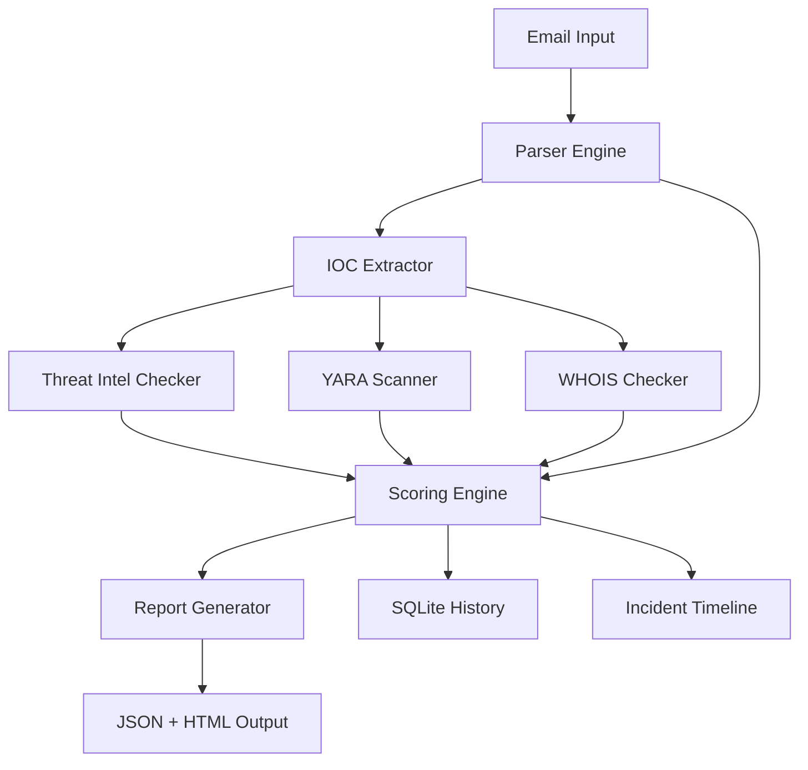

# Automated Phishing Triage Toolkit

A Python-based security utility for analyzing suspicious emails. Upload an `.eml` file or paste raw content, and the pipeline extracts Indicators of Compromise (IOCs), queries threat intelligence APIs, runs YARA rules, checks domain registration age, scores risk, and generates structured reports — via CLI or web UI.

Built as a portfolio-grade SOC triage workflow: parse → extract → enrich → score → report.

---

## Table of Contents

- [Features](#features)
- [Architecture](#architecture)
- [How It Works](#how-it-works)
- [Risk Scoring](#risk-scoring)
- [YARA Rules](#yara-rules)
- [Project Structure](#project-structure)
- [Requirements](#requirements)
- [Installation](#installation)
- [Configuration](#configuration)
- [Usage](#usage)
  - [Web UI](#web-ui)
  - [CLI](#cli)
  - [REST API](#rest-api)
- [Authentication (Optional)](#authentication-optional)
- [Reports & Output](#reports--output)
- [Deployment](#deployment)
- [Platform Limitations](#platform-limitations)
- [Security Notes](#security-notes)
- [Extending the Toolkit](#extending-the-toolkit)

---

## Features

### Email Parsing

- Parse standard `.eml` files (headers, body, attachments)
- Accept raw pasted text for quick triage without a full email file
- Extract **subject**, **from**, **to**, **date**, and plain-text body (falls back from HTML)
- **SPF / DKIM / DMARC** authentication result parsing from headers

### IOC Extraction

Automatically pulls from email body and attachments:

| Type                | Method                                          |
| ------------------- | ----------------------------------------------- |
| URLs                | Regex extraction                                |
| IP addresses        | IPv4 pattern matching                           |
| Domains             | From URLs + body text (common domains filtered) |
| MD5 / SHA1 / SHA256 | Hash pattern matching in body                   |
| Attachments         | Saved, sized, and **SHA256-hashed**             |

### Threat Intelligence

- **VirusTotal API v3** — URLs, IPs, domains, and file hashes (malicious/suspicious/harmless counts)
- **Cisco Talos** — IP and domain reputation lookup
- **WHOIS domain age** — flags newly registered or unregistered domains (always runs, even when other intel is skipped)

### YARA Rule Matching

- Scans email subject + body and attachment file contents
- Built-in rules for phishing lures, credential harvesting, suspicious URLs, double-extension files, PE executables, Office macros, and ransomware note language
- Heuristic filename detection for `.pdf.exe`-style masquerading
- Match severity feeds into the risk score

### Risk Scoring Engine

Composite 0–100 score combining:

- IOC volume (URLs, IPs, domains, hashes)
- VirusTotal detections
- Failed SPF/DKIM/DMARC
- Talos reputation
- WHOIS domain age signals
- YARA rule matches (capped contribution)

Verdict labels: **Likely safe** → **Needs review** → **High-risk suspicious** → **Critical phishing**

### Incident Timeline (Simulation)

Optional ransomware incident response timeline demonstrating IR thinking — from initial phish click through encryption, SOC isolation, and containment.

### Reporting

- **JSON** report per analysis run
- **HTML** report (styled, shareable)
- **Rich CLI dashboard** with color-coded tables
- **SQLite history** of past triage runs and IOCs

### Web UI

- Dark-themed SOC-style dashboard
- Upload `.eml`, paste text, or use built-in sample email
- Results page with verdict banner, auth checks, IOCs, WHOIS, VT/Talos, YARA matches, attachments, timeline
- Triage history view
- Portfolio demo mode (open access, no login required by default)

### Optional Authentication

- Opt-in login (`ENABLE_AUTH=true`)
- Admin account bootstrapped from environment variables
- Invite-only team registration
- API key support for programmatic access

---

## Architecture



**Entry points**

| Interface       | File                     | Purpose                 |
| --------------- | ------------------------ | ----------------------- |
| Web UI          | `main.py` → `web/app.py` | Browser-based triage    |
| CLI             | `app.py`                 | Terminal analysis       |
| Shared pipeline | `pipeline.py`            | Core logic used by both |

---

## How It Works

1. **Parse** — Read `.eml` or raw text; extract metadata, body, attachments, auth headers
2. **Extract** — Regex-based IOC extraction from body + attachment hashes
3. **Enrich** — Query VirusTotal, Talos, WHOIS; run YARA on body and files
4. **Score** — Weighted composite risk score (0–100)
5. **Verdict** — Map score to phishing classification
6. **Report** — Write JSON/HTML; persist run to SQLite
7. **Timeline** — Optionally generate ransomware IR simulation timeline

---

## Risk Scoring

| Signal                      | Points            |
| --------------------------- | ----------------- |
| Each URL                    | +10               |
| Each IP                     | +5                |
| Each domain                 | +3                |
| Each hash (MD5/SHA1/SHA256) | +8                |
| VT: malicious detection     | +50 per indicator |
| VT: suspicious detection    | +25 per indicator |
| SPF fail                    | +15               |
| DKIM fail                   | +15               |
| DMARC fail                  | +20               |
| Talos: poor/bad reputation  | +20               |
| Talos: neutral/questionable | +10               |
| WHOIS: unregistered domain  | +15               |
| WHOIS: domain < 7 days old  | +20               |
| WHOIS: domain < 30 days old | +10               |
| YARA: critical match        | +20               |
| YARA: high match            | +15               |
| YARA: medium match          | +10               |
| YARA: low match             | +5                |
| YARA total cap              | +35 max           |

**Verdict thresholds**

| Score  | Verdict              |
| ------ | -------------------- |
| 0–19   | Likely safe          |
| 20–49  | Needs review         |
| 50–79  | High-risk suspicious |
| 80–100 | Critical phishing    |

---

## YARA Rules

Located in `scanner/rules/`:

### `phishing_body.yar` — Email content

| Rule                          | Severity | Detects                                 |
| ----------------------------- | -------- | --------------------------------------- |
| `Phishing_Urgent_Language`    | Medium   | Urgent action phrases (2+ matches)      |
| `Phishing_Credential_Harvest` | High     | Verify account, password reset, etc.    |
| `Phishing_Suspicious_URL`     | Medium   | Login/verify/reset URL patterns         |
| `Phishing_Financial_Lure`     | Medium   | Wire transfer, invoice, overdue payment |
| `Phishing_HTML_Smuggling`     | High     | Script/eval/atob indicators             |

### `suspicious_attachments.yar` — Files

| Rule                                 | Severity | Detects                      |
| ------------------------------------ | -------- | ---------------------------- |
| `Suspicious_Double_Extension`        | Critical | `.pdf.exe`, `.doc.exe`, etc. |
| `Windows_PE_Executable`              | High     | MZ header at file start      |
| `Suspicious_Office_Macro_Indicators` | High     | AutoOpen, Shell(, PowerShell |
| `Ransomware_Note_Keywords`           | Critical | Encryption/ransom language   |

Add custom `.yar` files to `scanner/rules/` — they are compiled automatically on next run.

**Note:** YARA requires the native `libyara` library. See [Installation](#installation).

---

## Project Structure

```
phishing-triage-toolkit/
├── main.py                 # Vercel / production entrypoint
├── app.py                  # CLI entrypoint
├── pipeline.py             # Shared triage pipeline
├── config.py               # Environment and path configuration
├── pyproject.toml          # Python project + Vercel config
├── requirements.txt        # Core dependencies (Vercel-safe)
├── requirements-local.txt  # Full local deps (YARA, Rich, Gunicorn)
├── Dockerfile
├── Procfile
│
├── parser/
│   └── email_parser.py     # .eml parsing, auth headers, attachments
├── extractor/
│   └── ioc_extractor.py    # URL, IP, domain, hash extraction
├── intel/
│   ├── virustotal.py       # VirusTotal API v3 client
│   ├── talos.py            # Cisco Talos reputation lookup
│   └── whois_check.py      # Domain age / registration checks
├── scanner/
│   ├── yara_matcher.py     # YARA compilation and scanning
│   └── rules/              # .yar rule files
├── scoring/
│   └── risk_score.py       # Composite scoring + verdict
├── reports/
│   └── report_builder.py   # JSON + HTML report generation
├── timeline/
│   └── incident_timeline.py # Ransomware IR simulation
├── storage/
│   ├── ioc_db.py           # SQLite triage history
│   └── users_db.py           # Optional user accounts
├── web/
│   ├── app.py              # Flask web application
│   ├── auth.py             # Login / registration / API key auth
│   ├── templates/          # Jinja2 HTML templates
│   └── static/             # Legacy static assets
├── public/
│   └── css/style.css       # Web UI styles (served on Vercel)
├── scripts/
│   └── hash_password.py    # Generate password hash for auth
└── sample_emails/
    └── phishing_sample.eml # Built-in test email
```

---

## Requirements

- **Python 3.11+**
- **VirusTotal API key** (optional — intel calls skipped gracefully without it)
- **libyara** (optional — required for YARA matching locally)

---

## Installation

### 1. Clone and create a virtual environment

```bash
git clone https://github.com/kendoriddy/phishing-triage-toolkit.git
cd phishing-triage-toolkit
python3 -m venv .venv
source .venv/bin/activate   # Windows: .venv\Scripts\activate
```

### 2. Install dependencies

**Full local install** (CLI + Web + YARA + Rich dashboard):

```bash
pip install -r requirements-local.txt
```

**Core only** (web + pipeline, no YARA):

```bash
pip install -r requirements.txt
```

### 3. Install YARA (for rule matching)

```bash
# macOS
brew install yara
pip install yara-python

# Ubuntu/Debian
sudo apt-get install yara libyara-dev
pip install yara-python
```

### 4. Configure environment

```bash
cp .env.example .env
# Edit .env with your API keys and settings
```

---

## Configuration

All settings are loaded from `.env` via `python-dotenv`.

| Variable                     | Default                     | Description                          |
| ---------------------------- | --------------------------- | ------------------------------------ |
| `VT_API_KEY`                 | —                           | VirusTotal API key                   |
| `FLASK_SECRET_KEY`           | `change-me-in-production`   | Flask session secret                 |
| `FLASK_HOST`                 | `0.0.0.0`                   | Web server bind address              |
| `FLASK_PORT`                 | `8080`                      | Web server port                      |
| `MAX_UPLOAD_MB`              | `10`                        | Max `.eml` upload size               |
| `ENABLE_AUTH`                | `false`                     | Set `true` to require login          |
| `WEB_AUTH_USERNAME`          | —                           | Admin username (when auth enabled)   |
| `WEB_AUTH_PASSWORD`          | —                           | Admin password (plain text)          |
| `WEB_AUTH_PASSWORD_HASH`     | —                           | Admin password (hashed, alternative) |
| `WEB_API_KEY`                | —                           | Bearer token for `/api/analyze`      |
| `ALLOW_REGISTRATION`         | `false`                     | Enable invite-only team signup       |
| `REGISTRATION_INVITE_CODE`   | —                           | Secret code required to register     |
| `DOMAIN_AGE_SUSPICIOUS_DAYS` | `30`                        | WHOIS age threshold (suspicious)     |
| `DOMAIN_AGE_CRITICAL_DAYS`   | `7`                         | WHOIS age threshold (critical)       |
| `VT_URL_POLL_SECONDS`        | `8` (Vercel) / `15` (local) | Wait time after VT URL submission    |

Generate a password hash:

```bash
python scripts/hash_password.py
```

---

## Usage

### Web UI

```bash
python web/app.py
# or
python main.py   # same Flask app (Vercel entrypoint)
```

Open **http://localhost:8080**

- Upload an `.eml` file, paste email text, or check **Use built-in phishing sample email**
- Optionally skip VirusTotal/Talos (WHOIS and YARA still run locally)
- Optionally include ransomware incident timeline

### CLI

```bash
# Analyze sample email (skip external intel for speed)
python app.py sample_emails/phishing_sample.eml --skip-intel

# Analyze with full threat intel
python app.py sample_emails/phishing_sample.eml

# Paste raw text
python app.py --text "Click http://evil-verify.com to reset your password"

# Include ransomware timeline
python app.py sample_emails/phishing_sample.eml --simulate-ransomware

# View triage history
python app.py --history
```

### REST API

```bash
curl -X POST http://localhost:8080/api/analyze \
  -H "Content-Type: application/json" \
  -d '{"text": "URGENT: verify your account at http://fake-login.com", "skip_intel": true}'
```

When auth is enabled, include:

```bash
-H "Authorization: Bearer YOUR_WEB_API_KEY"
```

**Response:** Full triage report JSON (IOCs, score, verdict, intel results, YARA matches, timeline).

---

## Authentication (Optional)

Auth is **off by default** so portfolio visitors can try the demo immediately.

To enable login on a private deployment:

```bash
ENABLE_AUTH=true
WEB_AUTH_USERNAME=admin
WEB_AUTH_PASSWORD=your-strong-password
```

For team accounts:

```bash
ALLOW_REGISTRATION=true
REGISTRATION_INVITE_CODE=your-secret-code
```

Team members register at `/register` with the invite code, then log in at `/login`.

---

## Reports & Output

Each analysis creates:

```
output/runs/<run_id>/
├── report.json    # Full structured report
└── report.html    # Styled HTML report

output/runs/<run_id>.json   # Copy at runs root for web UI lookup
ioc_history.db               # SQLite: triage runs + IOC history
```

**Example verdict (sample email):**

```json
{
  "risk_score": 100,
  "risk_level": "Critical",
  "verdict": "Critical phishing",
  "iocs": {
    "urls": ["http://malicious-login-reset.com/verify?token=abc123"],
    "ips": ["192.168.1.100"],
    "domains": ["malicious-login-reset.com", "secure-bank-update.net"]
  }
}
```

---

## Deployment

### Local (Gunicorn)

```bash
pip install gunicorn
gunicorn --bind 0.0.0.0:8080 --workers 2 --timeout 120 main:app
```

### Docker

```bash
docker build -t phishing-triage .
docker run -p 8080:8080 --env-file .env phishing-triage
```

### Vercel (Portfolio / Demo)

Vercel auto-detects the Flask app via `main.py` (zero-config).

1. Push to GitHub
2. Import project at [vercel.com/new](https://vercel.com/new)
3. Set environment variables:
   - `VT_API_KEY`
   - `FLASK_SECRET_KEY`
   - `ENABLE_AUTH=false` (or omit — demo mode)
4. Deploy
5. Add custom subdomain under **Project → Settings → Domains**
6. Set **Functions → Max Duration** to **60s** (for VirusTotal lookups)

Dependencies are defined in `pyproject.toml` and `requirements.txt`.

### Railway / Render

Use the included `Procfile`:

```
web: gunicorn --bind 0.0.0.0:${PORT:-8080} --workers 2 --timeout 120 main:app
```

---

## Platform Limitations

| Feature            | Local / Docker | Vercel Serverless      |
| ------------------ | -------------- | ---------------------- |
| IOC extraction     | ✅             | ✅                     |
| WHOIS checks       | ✅             | ✅                     |
| VirusTotal / Talos | ✅             | ✅ (watch timeout)     |
| YARA matching      | ✅             | ❌ (no native libyara) |
| SQLite history     | ✅ Persistent  | ⚠️ Ephemeral (`/tmp`)  |
| Saved reports      | ✅ Persistent  | ⚠️ Ephemeral           |
| Auth               | ✅             | ✅                     |
| Attachments        | ✅             | ✅ (temp storage)      |

On Vercel, YARA fails gracefully with an explanatory message in the report. For full YARA support, use Docker or a VPS.

---

## Security Notes

- **Never commit `.env`** — it contains API keys and secrets
- **VirusTotal API key** stays server-side; visitors never see it
- **Portfolio demo mode** (`ENABLE_AUTH=false`) allows open access — appropriate for demos, not for production abuse-prone deployments
- **Do not upload real victim emails** containing PII to a public demo instance
- **Attachment extraction** saves files locally — review and clean `output/` and `sample_emails/attachments/` periodically
- Sample email contains **fake IOCs** for demonstration only

---

## Extending the Toolkit

### Add YARA rules

Drop new `.yar` files into `scanner/rules/`. Each rule should include:

```yara
meta:
    description = "What this detects"
    severity = "critical"   # critical | high | medium | low
```

### Add threat intel sources

Create a new module under `intel/`, return structured results, and wire it into `pipeline.py` and `scoring/risk_score.py`.

### Adjust scoring weights

Edit `scoring/risk_score.py` — all signal weights are in one place.

### Custom incident timelines

Pass custom events to `timeline/incident_timeline.build_timeline(custom_events=[...])`.

---

## Tech Stack

| Layer             | Technology               |
| ----------------- | ------------------------ |
| Language          | Python 3.11+             |
| Web framework     | Flask                    |
| HTTP client       | requests                 |
| Email parsing     | Python `email` module    |
| Templates         | Jinja2                   |
| CLI output        | Rich                     |
| Database          | SQLite3                  |
| Malware detection | YARA                     |
| Domain intel      | python-whois             |
| Deployment        | Vercel, Docker, Gunicorn |

---

## License

This project is provided for educational and portfolio purposes. Review third-party API terms (VirusTotal, Cisco Talos) before production use.
